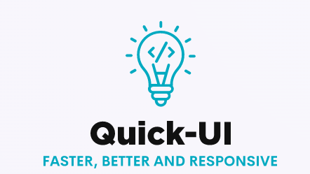
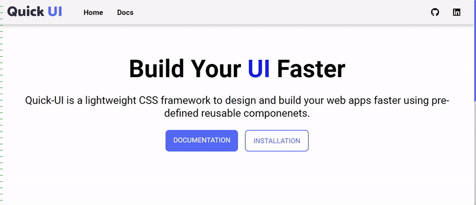

<div align="center">
  
  
# [QUICK-UI](https://quick-ui.netlify.app/index.html)
  <h3>A Lightweight Front-end library for easier and faster development of Web Interfaces. 🚀</h3>
</div>


## Installation

To get started add the following link tag to your head element of the HTML file.

```bash
  <link rel="stylesheet" href="https://quick-ui.netlify.app/component.css" />
```
    
## Documentation

[Docs](https://quick-ui.netlify.app/documentation.html)


## Components provided

- Alerts
- Avatar
- Badge
- Button
- Input
- Cards
- Images
- Typography
- List
- Navigation
- Modal
- Toast

## Others:
- ###  Sizes
    - ```sm``` - small
    - ```md``` - Medium
    - ```lg``` - Large
- ###  Font-size for Typography
    - Increase with the number from 1-5, ```heading-1``` being the largest and ```heading-5```  being the smallest
- ### Font-weight 
    - Increase as the numbers decrease from 3-0, ```bold-0``` being the least and ```bold-3```  having the maximum font weight

# Preview


